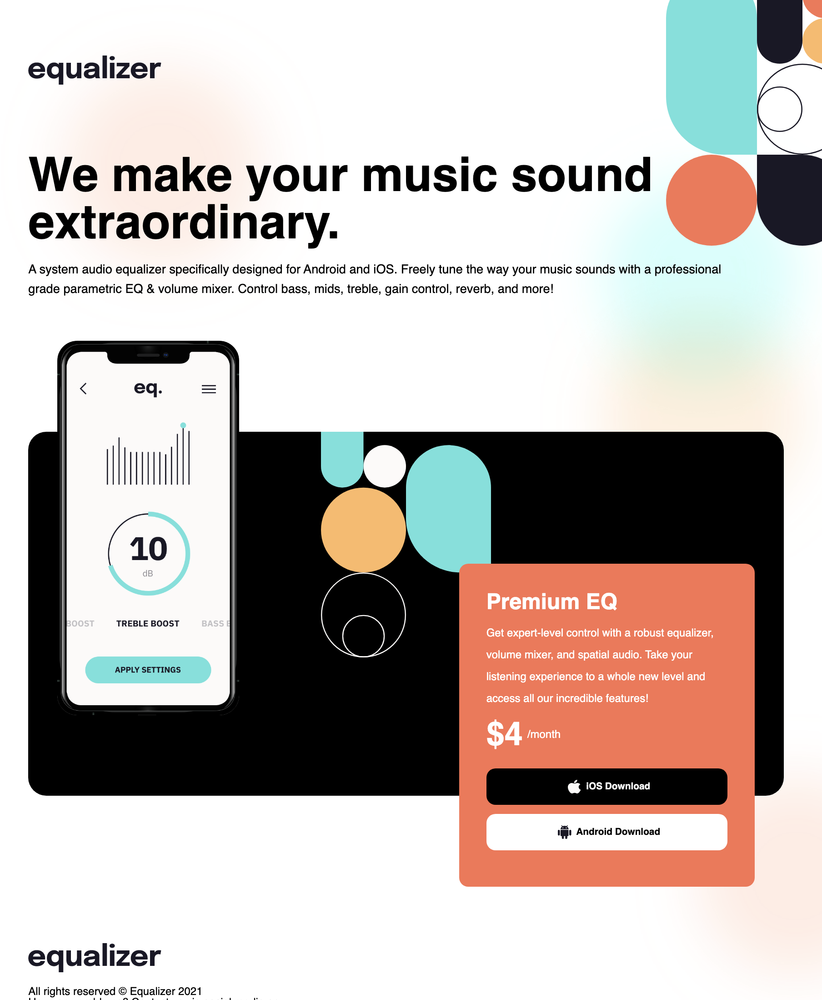

# Frontend Mentor - Order summary card solution

This is a solution to the [Equalizer challenge on Frontend Mentor](https://www.frontendmentor.io/challenges/order-summary-component-QlPmajDUj). Frontend Mentor challenges help you improve your coding skills by building realistic projects. 

### Screenshot

### Links

- Solution URL: https://github.com/maxkaiser100/equalizer.git
- Live Site URL: https://maxkaiser100.github.io/order-summary/

## My process

### Built with

- Semantic HTML5 markup
- CSS custom properties
- Flexbox
- Grid

### What I learned

Major learning of how to make CSS grid responsive. Also using grid areas was new.
Also learning absolute positioning tricks.

## Author

- Frontend Mentor - @maxkaiser100

## Acknowledgments

